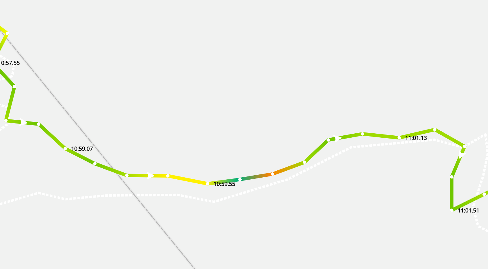

# What is this

This is a PoC for displaying the speed of a route on a map. 
It wil use a line-gradient property. I was inspired by this example.
https://docs.mapbox.com/mapbox-gl-js/example/line-gradient/

For example this is a hike:


### Example
https://zoutepopcorn.github.io/mapbox-color/

### Todo
* a lot

### Install

npm i

### Run

npm run start


### Api key
The api key from mapbox examples is used. You can set it to your API key. 
```javascript
mapboxgl.accessToken = 'pk.eyJ1Ijoiem91dGVwb3Bjb3JuIiwiYSI6ImNqaDRxem9sNDE1Zmwyd2xuZG1iYTl0OXcifQ.r4qZMpEbr2FoCN4sd97kDw';
```


